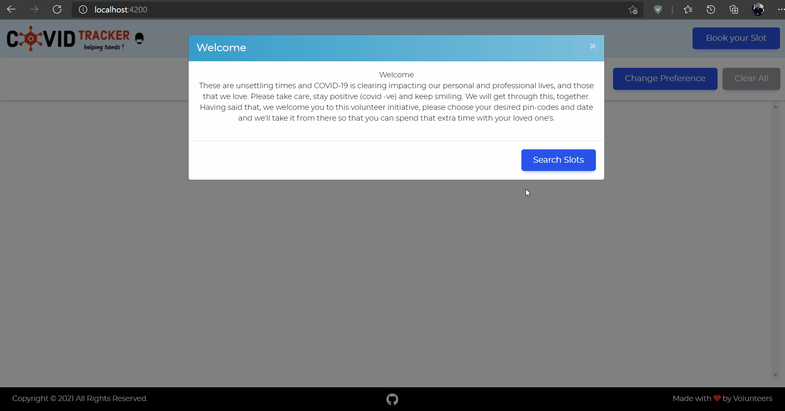

# Covid Tracker India

This project is an initiative taken by volunteers to help everyone search vaccination slots in a better and efficient way with least amount of efforts, you can choose your preferences and we'll do the hard work for you.

## Demo

## Project Roadmap

Here, are the current plan and progress of various components of this project. The components will be prioritized based on users requests and importance.

### Sections

- [x] Done        - [ ] To do

- [x] **Vaccination Slots**

  - [x] Search by multiple pin-code.
  - [x] Auto refresh of results
  - [x] Show by free-paid slots
  - [x] Detailed info about sessions at centre.

- [ ] **Search by District**

  - [ ] Search by district id.
  - [ ] Auto refresh.

- [ ] **Download vaccination certificates**
- [ ] **Covid statistics**
- [ ] **Automatic slot booking**

## Technologies Used
* [Angular 8](https://angular.io/)
* [jQuery](https://jquery.com/)
* [Bootstrap](http://getbootstrap.com/)
* [Typescript](https://www.typescriptlang.org/)

## APIs Used

* [Co-WIN Public APIs](https://apisetu.gov.in/public/marketplace/api/cowin/cowin-public-v2#/Appointment%20Availability%20APIs/calendarByPin) see [API Terms of Service](https://apisetu.gov.in/public/marketplace/api/cowin/terms.php)

## License

The code in this project is licensed under the MIT License. See [LICENSE](LICENSE) for details.

Note that you will be responsible for following terms of service of the third party APIs used in the code, we take no responsibility of forked or cloned projects.

## Contributors

Thanks goes to these wonderful people :

<!-- ([emoji key](https://allcontributors.org/docs/en/emoji-key)) -->
<table>
  <tr>
    <td align="center"><a href="https://ipankajsingh.com"> <b>Pankaj Singh</b></a> </td>

  <td align="center"><a href="#"> <b>Prashant Giri</b></a> </td>

   <td align="center"><a href="#"> <b>Saurabh Yadav</b></a> </td>

  <!-- <td align="center"><a href="#"> <b>Neha Patial</b></a> </td>

  <td align="center"><a href="#"> <b>Devdatta Chilwant</b></a> </td> -->
  </tr>
</table>

